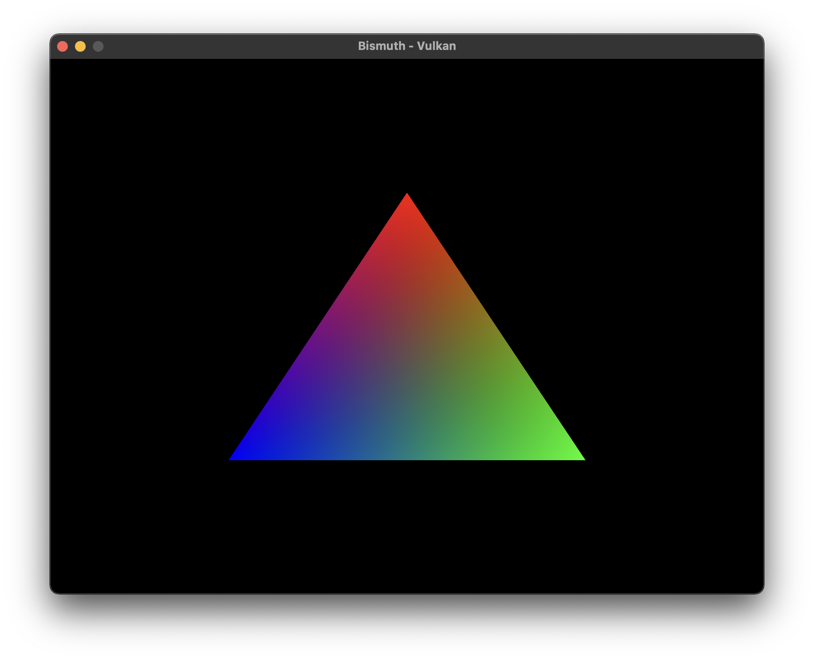

# Bismuth
Bismuth is a little home made graphics engine made for learn vulkan and experiment things...



## Compatibility
| Windows | macOS | Linux          |
|---------|-------|----------------|
| ✅       | ✅    | ⚠️ (not tested) |

## Requirement
- Compiler that support C++ 17 or above
- [CMake](https://cmake.org/download/) v3.8 or above
- [Vulkan SDK](https://vulkan.lunarg.com/) v1.0 or above

## How to install
You must clone this repos using the `--recurse-submodules` flag because I use [GLFW](https://github.com/glfw/glfw.git) and [GLM](https://github.com/g-truc/glm.git) repos.
```sh
$ git clone --recurse-submodules https://github.com/5aitama/BismuthEngine
```

## How to build
Once you have cloned the repos, you need to create a `build` folder on it and run `cmake` & `make` to build the engine.
```sh
$ cd ${CLONED_REPO_PATH}
$ mkdir build
$ cd build
$ cmake -DCMAKE_BUILD_TYPE=Debug ..
$ make
```